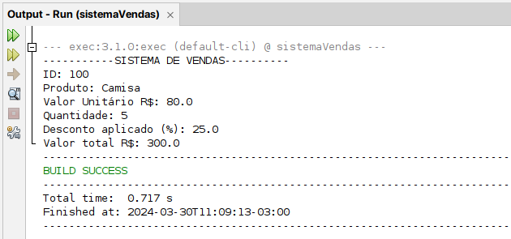
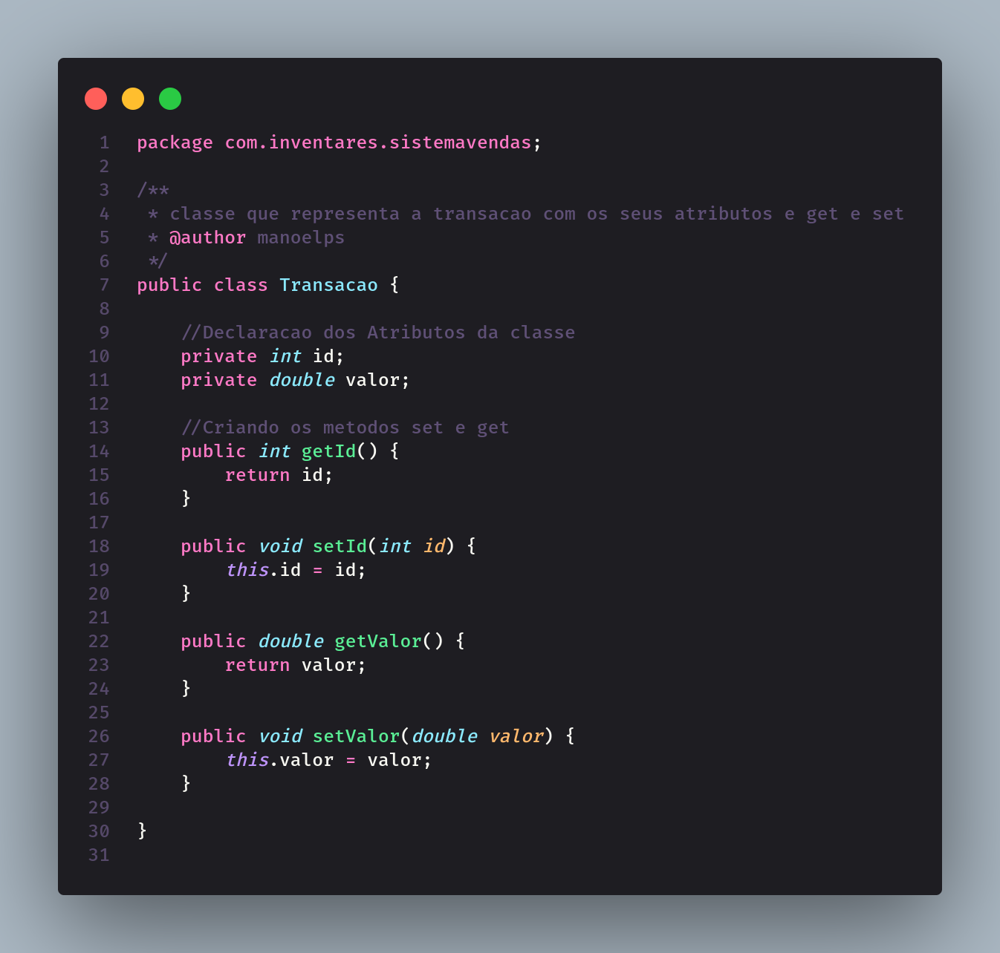
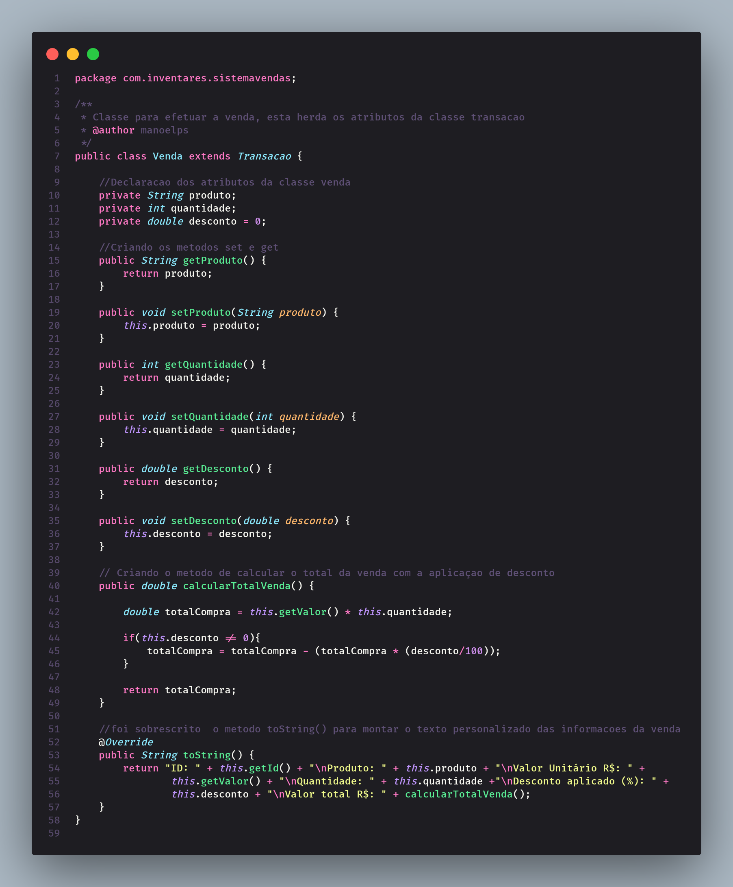
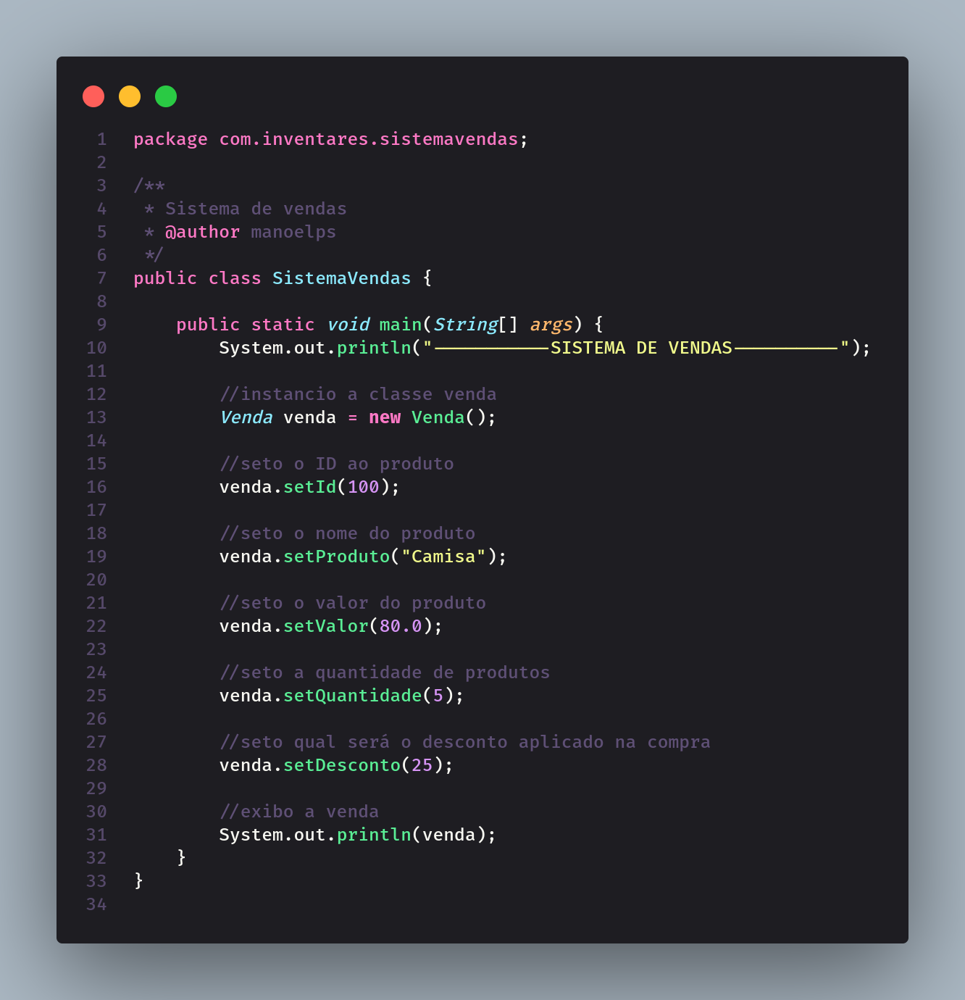

# sistema-vendas-em-java

Projeto criado em [JAVA](https://java.com/).

Projeto para simular uma venda (fornecer produtos, definir valores, e aplicar descontos).

Disciplina: Disciplina: Programação Orientada a Objetos (10700010053_20241_01)

## Conceitos aplicados:

`encapsulamento`, `herança`,
`polimorfismo` e `sobrescrita`

## Abrindo o projeto no NetBeans

Em um diretório de sua preferência, execute para clonar o projeto:

`git clone git@github.com:manoelps/sistema-vendas-em-java.git`

Abra NetBeans e acesse o menu conforme abaixo

`File > Open Project`

Navegue até o diretório que acabou de clonar e click no botão `Open Project`.

## Execução com o NetBeans

Agora que o projeto está aberto aperte no seu teclado a tecla `F6` para executá-lo

